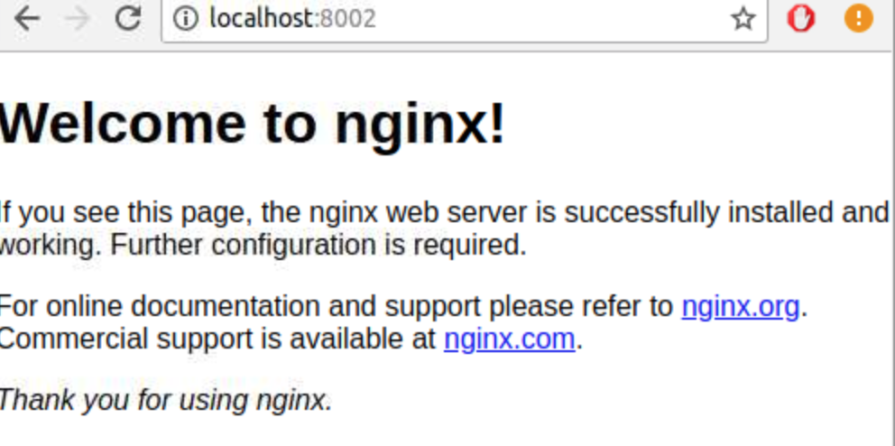

Lab 3.1: Ports
============

## Overview

So, we have had fun executing linux commands on our container.   How do we do networking on our container?  Networking is
going to be picked up by our host.  So, we need to specify what ports we want forwarded to the container

Here's how we do port forwarding.

```bash
docker container run -p HOSTPORT:CONTAINERPORT

```


## Step 1: Run

We run this, and this means port 8002 on the host is pointed to port 8002, which is mapped to port 80 on the container

```bash
docker container run -p 8000:80 nginx
```

```console
docker container run -p 8002:80 nginx
Unable to find image 'nginx:latest' locally
latest: Pulling from library/nginx
f2aa67a397c4: Pull complete
3c091c23e29d: Pull complete
4a99993b8636: Pull complete
Digest: sha256:0fb320e2a1b1620b4905facb3447e3d84ad36da0b2c8aa8fe3a5a81d1187b884
Status: Downloaded newer image for nginx:latest
172.17.0.1 - - [24/May/2018:04:25:57 +0000] "GET / HTTP/1.1" 200 612 "-" "Mozilla/5.0 (X11; Linux x86_64) AppleWebKit/537.36 (KHTML, like Gecko) Chrome/65.0.3325.181 Safari/537.36" "-"
2018/05/24 04:25:57 [error] 6#6: *1 open() "/usr/share/nginx/html/favicon.ico" failed (2: No such file or directory), client: 172.17.0.1, server: localhost, request: "GET /favicon.ico HTTP/1.1", host: "localhost:8002", referrer: "http://localhost:8002/"
172.17.0.1 - - [24/May/2018:04:25:57 +0000] "GET /favicon.ico HTTP/1.1" 404 572 "http://localhost:8002/" "Mozilla/5.0 (X11; Linux x86_64) AppleWebKit/537.36 (KHTML, like Gecko) Chrome/65.0.3325.181 Safari/537.36" "-"

```

## Step 2: Go to Browser

Open up a browser and go to the following url:

```
http://localhost:8002
```

If you are running locally. If you are running in the cloud, go to your IP address;

```
http://YOURIPADDRESS:8002
```


You should see the following:

```console
Welcome to nginx!

If you see this page...

Thank you for using nginx.
```

<p></p>


## Step 3: Stop the container

Press Cntrl-C to stop the container.

Now, try going back to the browser and re-loading. Do you see the page?

The page doesn't work while the contianer is stopped!

## Step 4: Run the container in the background

```bash
docker container run -p 8002:80 -d nginx
```

You will see the new container id copied to the screen, as this runs in the background

```console
ffcee5395fc4fc4ca97c48b03b3510ec973c6fa8601e9b299e306a6d36f6ff74
```

## Step 5: Go back to the page

As in step 2, go back to the page.  You should see nginx running again.

## Step 6:  Stop the container

``` 
docker stop <paste-container-id-here>
```

It sohould stop your container. If it does not recognize the container id you pasted, say "docker ps" to get the list of container ids.

