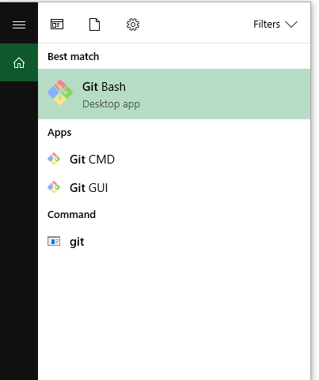
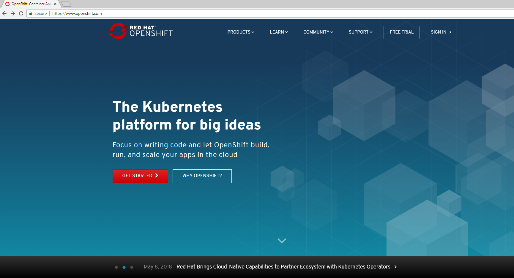
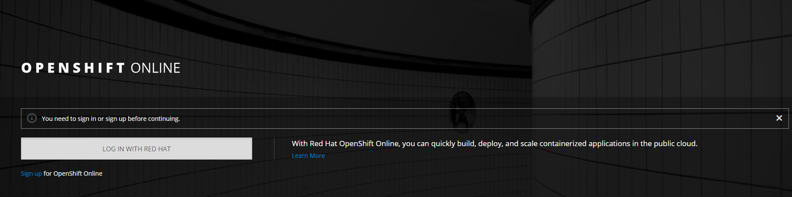
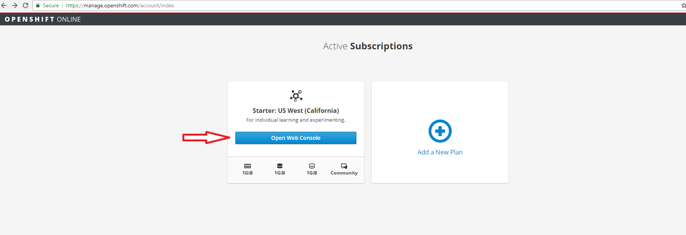
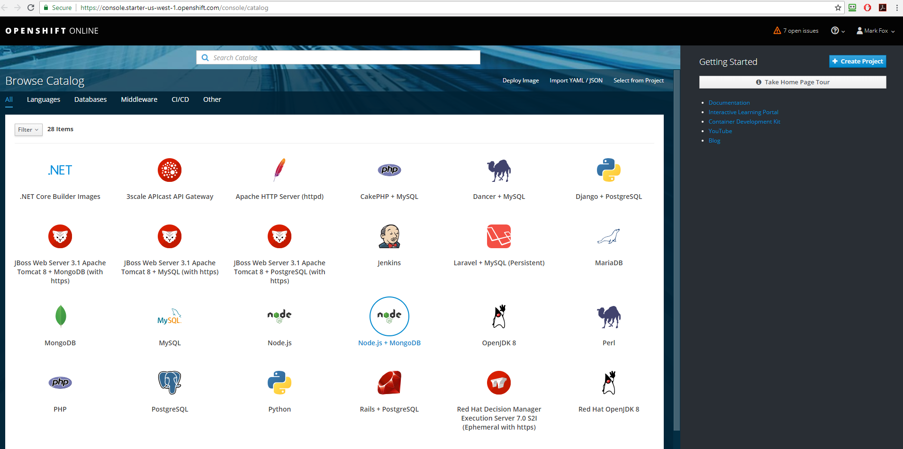
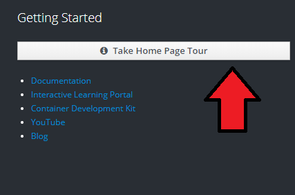
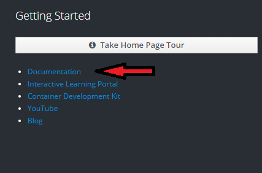

# Openshift Lab 1.1:
===============

## Getting started with Openshift Online

### Prerequisites
 * A computer system with internet connectivity.
 * A Github account.
 * Download Git software as described in Step 1.

### Topics to Cover
 * Installing Git software
 * Sign up for Openshift Online starter plan
 * Get familiar with the Openshift website

### Step 1 - Installing Git Software (if you do not have it already)
 * Most Linux computers have Git installed, but it can be installed from your package manager.
 * For MAC, Git is included in the Apple development tools or it can be downloaded.
 * For Windows, download Git from the website.
 * The download website for Git is: https://git-scm.com/downloads .
 * After downloading the Git software, follow the installation prompts.
 * If using firewall software, make sure it is configured to allow Git to access the internet.
 * The name of the terminal on Windows is Git Bash.  If you cannot locate the Git Bash software after installing, type "Git Bash" into the Windows search bar.

 

### Step 2 - Sign Up for Openshift Online
 * Navigate your web browser to: https://www.openshift.com .
 * Click on the red "Get Started" Button as pictured.

 

 * Click the red "Create a Free account button."
 * On the next page, click the blue “Sign up” link on the left lower corner.

 

  * Sign up or sign in.
    * If you have a Red Hat® account, you may use your Red Hat® user ID.
    * You may login with your Github account by clicking the Github button at the bottom of the screen.

    

    * Or you may click on the "Create one Now" button to create a Red Hat® account.

  * Once you have signed up for an account, chose the free starter plan and it will take you to this page below. Click the blue button “Open Web Console."

  

### Step 3 - Review the Openshift Online Website
  * Once you click the blue button as above, it will show you the web console.

  

  * Familiarize yourself with the web console by clicking the “Take Home Page Tour” button on the upper right corner.  This will introduce you to some of the parts of the web page.

  

  * Click on the blue documentation link.

    

  * The link to the documentation page is: https://docs.openshift.com/online/welcome/index.html .
  * Click on the link on the page that says:
     Check out a walkthrough on creating your first app.

  * Click on the link that says basic walkthrough and it will take you to this page:
  https://docs.openshift.com/online/getting_started/basic_walkthrough.html#getting-started-basic-walkthrough .
  * Bookmark the link to use as a reference for the next lab.
