# Openshift Lab 1.2:
===============

## Installing a Sample App

## Prerequisites
 * A computer system with internet connectivity.
 * A Github account.
 * Complete Openshift Lab 1.1 first.
 * A free Openshift Online account.
 * Git needs to be installed locally on your system.

### Topics to Cover
 * Forking an app on Github repository.
 * Using Git to clone the application on your local system.
 * Create a project using the Openshift web console.
 * Install the application on the Openshift online server.
 * Configure automatic builds for your application.

### Note
  * This lab is based on the Openshift basic walkthrough web page but we will use a different application.
  * Navigate to the Basic Walkthrough page below and keep it open for your reference. https://docs.openshift.com/online/getting_started/basic_walkthrough.html#getting-started-basic-walkthrough
  * The free starter plan for Openshift Online allows you to only have one project at a time; so if you want to try another project later, you will need to delete the project installed in this tutorial.

### Step 1 - Select an App and Clone it on Your System.
 * Open up a separate web window/tab to https://github.com/ and sign in using your Github credentials.

 * Navigate to the following url: https://github.com/elephantscale/hello-openshift-nodejs .
   * This will bring you to the elephantscale/hello-openshift-nodje repository with an example Node.js application which will display a message on the site.

 * On the upper right hand corner of the Github repository, click on the "Fork" button.  This will provide you with your own copy of the app in your Github account.

  <p style="text-align:center;"></p>

 * If using Windows, open the Git Bash console on your local computer as described in Openshift Lab 1.1. If using Mac or Linux computers, you can use the terminal.
 * Enter the following commands into the Git Bash console or terminal to clone the example application to your local computer. Put your actual Github username in place of "username." (Do not type the $ sign.)

 ```bash
 $ git clone https://github.com/username/hello-openshift-nodejs
 $ cd hello-openshift-nodejs
```

### Step 2 - Create a Project Using the Openshift Web Console
  * In a new window/tab, navigate to the Openshift web console. The link is below. Sign in using your user id and password if required.    
     https://console.starter-us-west-1.openshift.com/console/catalog

  * Click on the blue "Create Project" link on the upper right hand of the screen.

  <p style="text-align:center;">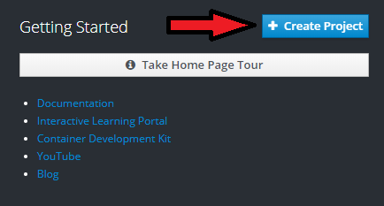</p>

  * Create a unique name for the project and type it in the Name field. For example, you could use "username-example" with no spaces or quotes. Replace username with your own username.

  * Fill in brief details under the display name and description.

  * Click the blue create button as below.


  <p style="text-align:center;">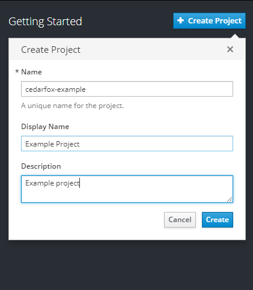</p>

  * You should receive a small notification on the upper right hand of the screen saying that your project was created.  After a couple of minutes, the name of your project should appear at the top right of the screen as pictured.

  * If you need to delete the project later, notice that you have that option if you click on the three white circles to the right of your project name. But don't delete it now.

  * Click on your project name -- in this case: "Example Project."

  <p style="text-align:center;">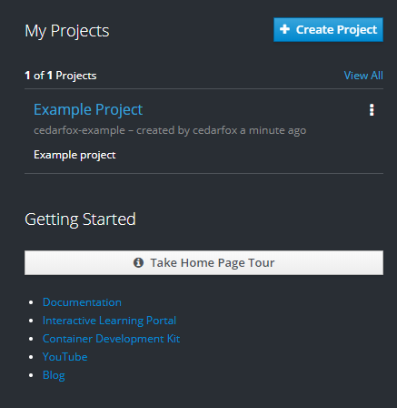</p>


### Step 3 - Install the Application on the Openshift online server
  * Click on the "Browse Catalog" blue button as pictured below.

<p style="text-align:center;">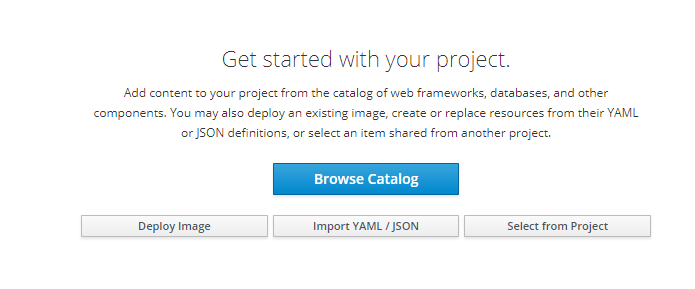</p>

  * Under "Select an item to add to the current project" click on "Languages."

  * In the list of programming languages, click on "JavaScript." Then click the "Node.js" button on the left.

  <p style="text-align:center;">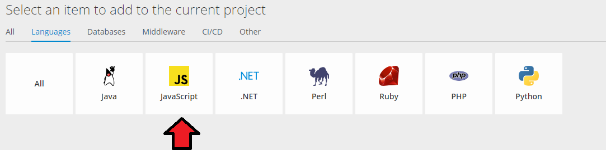</p>

  <p style="text-align:center;">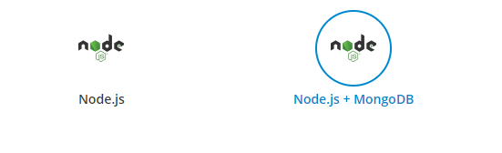</p>

  * A window will open that says "Nodejs.""  Click the blue "next" box.
  * A configuration page will open.  You can use the latest version of Nodejs.
    * Type application name as       
          hello-openshift-nodejs

    * Type Git repository name as below but replace username with your actual Github user ID.

             https://github.com/username/hello-openshift-nodejs.git


  <p style="text-align:center;">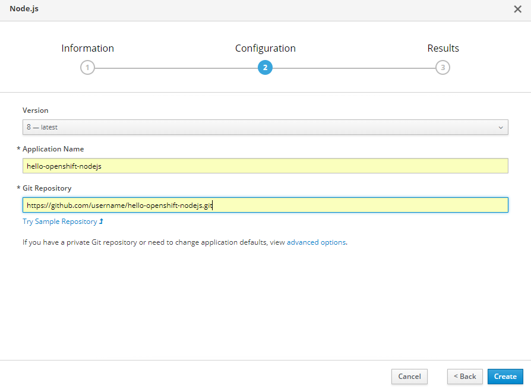</p>

  * Click the blue "Create" Button. It may take a few minutes to complete.

  * Click on the blue "Close" button.

  * Click on the Overview button to view the status of the application.

  <p style="text-align:center;">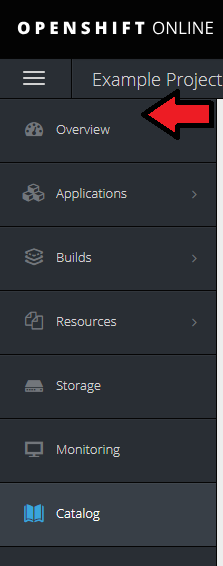</p>

* It will take a couple of minutes to load the application on the Openshift Online server, but the overview will show you the status of the app.  When it is ready, there will be a web address of your application which you can click to see the application.

* The application should show the following text on your web browser with your unique web address.

<p style="text-align:center;">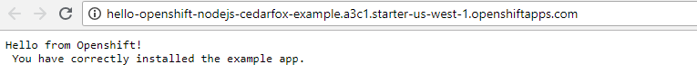</p>


### Step 4 - Configuring Your Application for Automatic Builds

A Github **webhook** allows you to automatically rebuild your application on the Opershift server whenever you update your application and push the changes to your Github repository.

 * From the project view, click on the "Builds" button on the upper left part of the screen, then click the smaller "Builds" in the menu that opens up.

<p style="text-align:center;"></p>

 * Next, click on the name of your application.

 <p style="text-align:center;">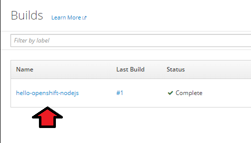</p>

 * Click on the Configuration tab.

 <p style="text-align:center;">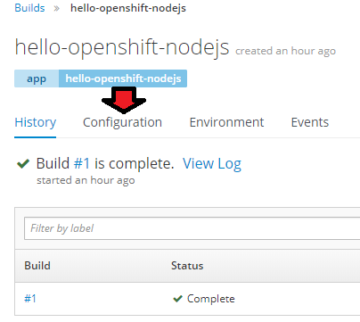</p>

 * Click on the copy icon to the right of the Github webhook URL field. This will copy the URL to your clipboard.

 <p style="text-align:center;">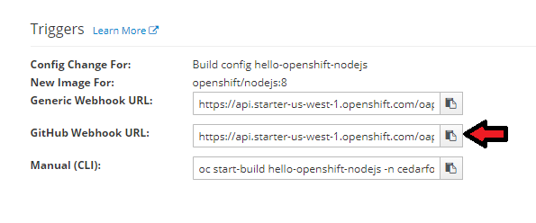</p>

 * Navigate your browser to your forked Github repository. If using the link below, replace username with your actual Github user name.

        https://github.com/username/hello-openshift-nodejs

 * Click on the Settings button.

 <p style="text-align:center;">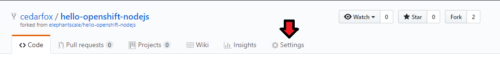</p>

 * Click on the webhook tab on the left and then click the Add Webhook button on the upper right.

 <p style="text-align:center;">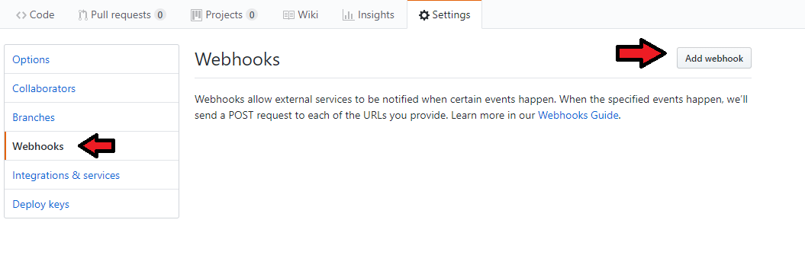</p>

 * Select the Payload URL field and press ctrl-V to paste the URL you copied to the clipboard earlier.  You can also paste by right-clicking over the field and left-click "Paste."

 * Under Content type, select application/json.

 <p style="text-align:center;">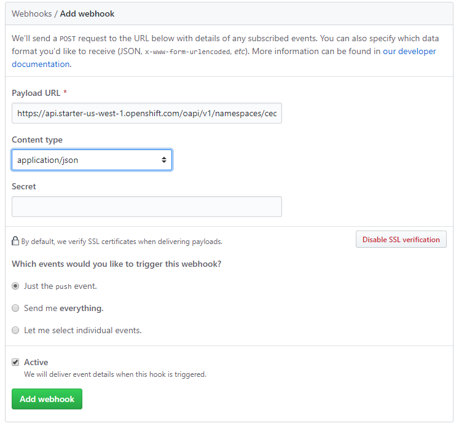</p>


 * Click on the "Add webhook" button.  A green check to the left of the address means it correctly configured. (It may not show a check until you use Git to push changes). 

<p style="text-align:center;">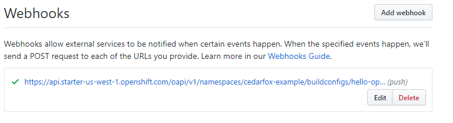</p>


## Thanks for completing Openshift Lab 1.2!

# Notes
 * Please review the Openshift basic walkthrough for a few more details and information on how to scale your application.  https://docs.openshift.com/online/getting_started/basic_walkthrough.html#getting-started-basic-walkthrough
