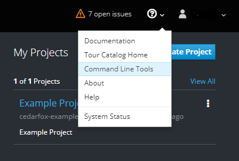
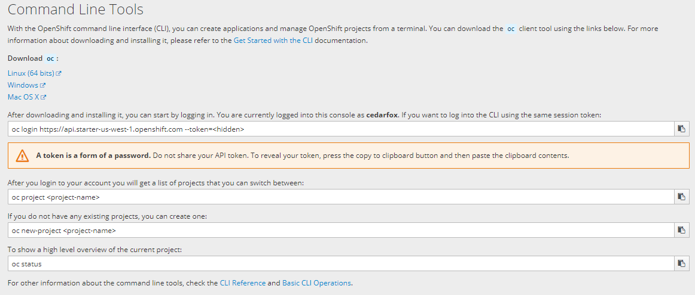
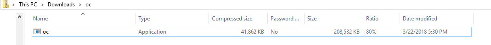
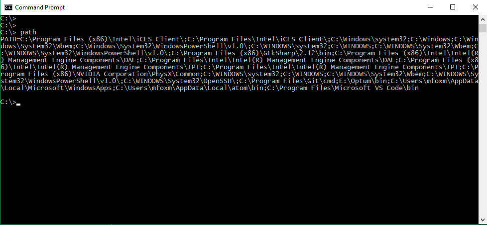
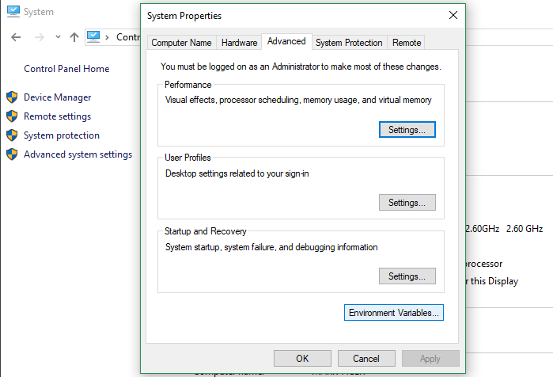
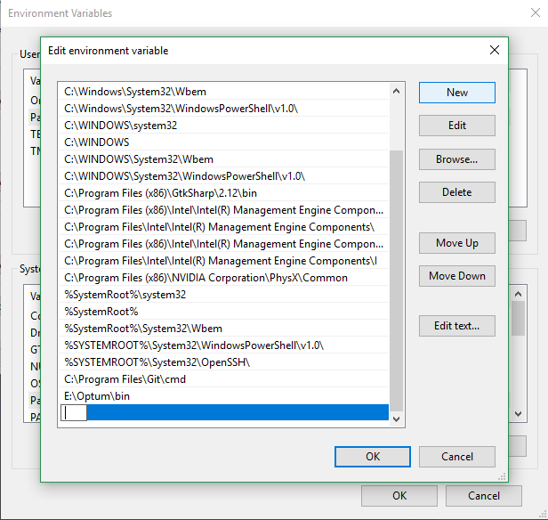
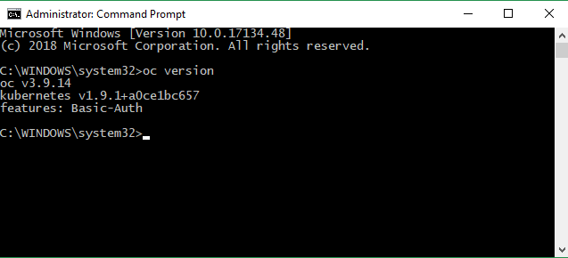

# Openshift Lab 1.3:
===============

## Installing Openshift Command Line Interface

### Prerequisites
 * A computer system with internet connectivity.
 * A Github account.
 * Openshift Online account set up.
 * Git software installed.
 * Complete Openshift Labs 1.1 and 1.2 before this step.
 * Keep an open browser window logged in to your Github account.

### Topics to cover
 * Installing the Openshift Command Line Interface (CLI).
 * Introduction to oc.exe command.

### Step 1 - Installing Openshift CLI

  * Login to your Openshift online account and navigate to the web console.
  * On the top right of your screen you will see a ? with a down arrow as pictured below.
  * Click on the down arrow and then click on "Command Line Tools."


<p style="text-align:center;"></p>

   * This will bring you to a screen as pictured below.

   * Under the line on the top left that says "Download", click on the download link based on the operating system you are using.


 <p style="text-align:center;"></p>

   * Once the file is downloaded, open the download folder/directory containing the downloaded file. The name of the file should be oc.exe. This is how it looks if using Windows.

 <p style="text-align:center;"></p>

* Choose which PATH directory you want to copy the oc.exe file to.
     * Check existing path directories by opening a command prompt.
          * In Windows
               * Type cmd in the search bar and Click on "Command Prompt."
               * In the command prompt type: "path".
               * A list of current path directories will display in the command prompt
               * Choose one of the existing directories/folders in PATH for you to copy the oc.exe file or add a new directory as described below.

<p style="text-align:center;"></p>

  * In Linux/MAC:
    * Open the terminal and type this command to display the current PATH directories.


            $ echo $PATH


  * Add a new directory to the PATH (if needed).

      * In Windows:
         * Open the control panel, click "System."
         * Click "Advanced system settings" on the top right; a "System Properties" window will open.
         * Click on the box at the bottom of the "System Properties" window which says "Environment Variables."


<p style="text-align:center;"></p>

  *  A new box opens.  Look under the lower box which says "System variables" and Click "Path." Then click the "Edit button" underneath.

  * A box with lists of directories in PATH appears. Click "NEW" on the top right.

  * This makes a new empty field; you should type the path to the directory where you want to copy the oc.exe file.

    <p style="text-align:center;"></p>


  * Then close the 3 windows by clicking OK on each.

* Linux/MAC: To make a new directory in PATH,  open the terminal and type the command below. Replace "/path/to/my/directory" with your actual path.

  ```console
  export PATH=$PATH:/path/to/my/directory
  ```

  * Unzip or extract the oc.exe file to a PATH location on the local computer.

      * Windows instructions:
         * Right click over the name of the application "oc" (oc.zip)
         * Select "Extract all..."
         * Enter or browse to a directory in the PATH destination for copying the oc file.
         * Click Extract

   * Mac/Linux instructions
        * Extract the oc.exe file and copy the file to the chosen directory in PATH.

To run the oc command line interface:
* In Windows, you need to open the command prompt "as an administrator."

    * Type "cmd" in the search bar and right click on "Command Prompt" in the start menu.
       * Left click on "Run as administrator."
       * The command prompt will open.
       * Type the following command to make sure it is working. It should display version detail.

                  oc version

    <p style="text-align:center;"></p>

* In Linux/Mac you can use the "oc version" command from your terminal to ensure it is installed properly.

* An Introduction to using the Openshift CLI found in Openshift Lab 2.1.

Notes:

For more information on the command line interface check the following links:

Information obtained from https://docs.openshift.com/online/getting_started/beyond_the_basics.html#getting-started-beyond-the-basics
https://blog.openshift.com/installing-oc-tools-windows/
https://docs.openshift.com/online/getting_started/beyond_the_basics.html#getting-started-beyond-the-basics

## Thanks for completing Openshift Lab 1.3!
