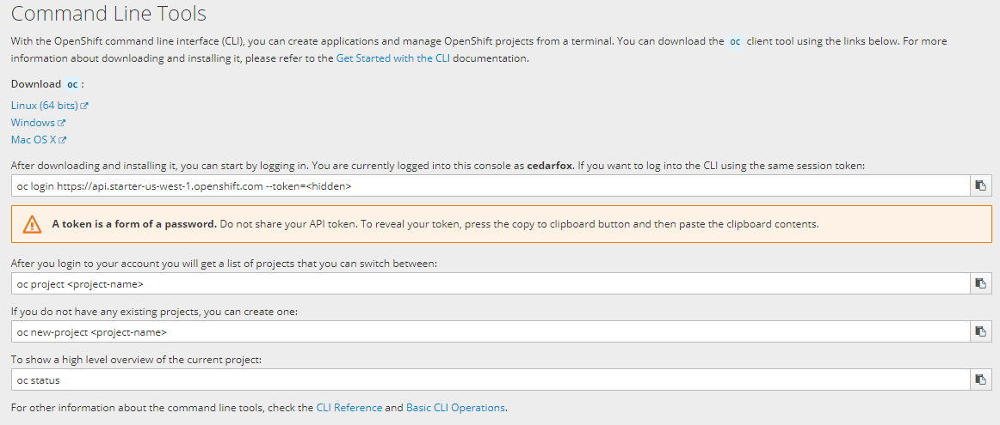

# Openshift Lab 2.1:
===============

## Introduction to Openshift Command Line Interface

### Prerequisites
 * A computer system with internet connectivity.
 * A Github account.
 * A free Openshift Online account.
 * Git software installed.
 * Complete Openshift Labs 1.1, 1.2, 1.3 before this step
 * Keep an open browser window logged in to your Github account
 * Open command prompt/terminal (as instructed in Lab 1.3) to use the Openshift Command Line Interface (CLI).

### Topics to Cover
 * Login to Openshift using CLI.
 * Delete existing project or projects using the CLI.
 * Create a project using the CLI.
 * Deploy an example application from source code.
 * Configuring a route for your application.
 * Logout of Openshift CLI.

### Step 1 - Command Line Interface Login
Open the command line interface (if it is not still open). Remember to open it as an administrator if you are using Windows.
* In the command prompt type:

        oc help

* Read through the list of available commands.

* If you want help with a specific command, type "oc command -- help". Instead of the word command type the actual command. Try typing the command below.

      oc login --help

* This gives you helpful information for knowing how to login to your Openshift service using CLI.  
* In order to login, you will need to get some information from your Openshift online account.
   * Go back to the screen on your Openshift online web console to where you downloaded the oc.exe file in Openshift Lab 1.3.

   * Under the download links, copy the session token by clicking on the copy icon to the right of the top field (Under the Mac OS X download link) as pictured below.

   

   * Your login command with the session token should now be copied to your clipboard.
* Go back to your Command Prompt or terminal and login to your Openshift account.

* Paste the text into the Command Prompt or Terminal.  You can use Ctrl - V if your O/S supports it.   Hit enter.

* If it works, it will say that you have logged in and it will provide basic information as below.  It should say your actual user name instead of username.

      Logged into "https://api.starter-us-west-1.openshift.com:443" as "username" using the token provided.
      You have one project on this server: "username-example"
      Using project "username-example".

      C:\WINDOWS\system32>

### Step 2 - Delete Existing Projects or Apps or Services

* In order to try to install another project, you must not have any projects installed already. (If you are using the Openshift Online starter free plan.) We will learn how to delete existing projects by using the CLI.

* Note that if you want to delete the entire project, then you only need to use the "oc delete project" command.  The "oc delete" command can also delete specific objects or items from your project.

* If you do not have any projects now, you do not need to delete a project below.

* Type the following command into the command prompt or terminal.

      oc get projects

* You will see a list of projects if you have any. To select a project use this command below. Replace username-example with the actual name of your project.

      oc project username-example

* Delete the objects in your selected project with this command.

      oc delete all --all

* It should list the names of the objects deleted.
* Check the names of any persistent volume claims PVC.

      oc get pvc

* If it says "No resources found," you do not need to delete it.
* If you have any PVC, such as mongodb, delete it using:

      oc delete pvc mongodb

* Now go ahead and delete the project with this command. Replace username-example with the actual name of your project.  

      oc delete project username-example

* Check the status of available projects; if you only had one project, you should not have any projects now.

      oc projects

* To change to another project, you will type "oc project" then the project name. Just for your information, If you had another project named "project2" you could type the command below.

      oc project project2

## Step 3 - Create a Project Using the CLI
In this step, create a project and then we will deploy an application in Step 4.

* For examples below, instead of typing username-example, type a unique project name.  As before, you can use replace the word "username" with your actual username.

* Option 1: Minimal description.

      oc new-project username-example

* Option 2: Full description. Use the following arguments with the command.
    * --description="" is for the project description.
    * --display-name="" is for the project display name.
    * Names in description and display name can have spaces but must be in quotes.

          oc new-project username-example --display-name="Example Project" --description="Example Project made with CLI"

Note: The actions you use with oc affect the project you are currently on. If you have more than one project you will need to make sure you are on the right project.  To check which project you are currently on, use this command.

          oc project

* Note that oc projects tells you the list of projects, and oc project tells you which one you are on.

## Step 4 - Deploy an app from source code
In this step we will deploy the same application we used in Openshift Lab 1.2; but this time, we will use the command line.
* In Lab 1.2 Step 1, we instructed you to Fork an application to your Github account from:
  https://github.com/elephantscale/hello-openshift-nodejs

* If you have already forked this application to your own Github account, and cloned the application to your local system, you do not need to do it again.   If not, go to Lab 1.2 Step 1 and follow the directions until you get to Step 2, then return back here.  

* Using a separate web browser window/tab, log in to Github.com and keep that page/tab open.

* Navigate to the example app hello-openshift-nodejs in your Github account, then copy the Github URL to your clipboard.  You can select the text and use Ctrl - C if your O/S supports it.

* The URL should look like this with your actual username instead of the word username. https://github.com/username/hello-openshift-nodejs

* In the command prompt or terminal type this command to deploy the application.

          oc new-app https://github.com/cedarfox/hello-openshift-nodejs

* Type this command to check the status of the running application.

          oc status

* The app should be running but not exposed, so you cannot access the app via your browser yet.

## Step 5 - Configuring a Route for Your Application
You will not be able to view the running application in a web browser until you configure a route.
* In the command prompt or terminal type the command.

      oc get services

* It should display something like the following. (Shown on windows computer. Do not type the path.)

      C:\WINDOWS\system32>oc get services
      NAME                     TYPE        CLUSTER-IP       EXTERNAL-IP   PORT(S)    AGE
      hello-openshift-nodejs   ClusterIP   172.30.253.226   <none>        8080/TCP   13m
      C:\WINDOWS\system32>_

* To expose the routes for your application so it can be accessible, type the following command.

      oc expose service/hello-openshift-nodejs

* If successful it will say "route "hello-openshift-nodejs" exposed".  Now type this command.

      oc get routes

* This will display:
    * the name of the app - "hello-openshift-nodejs ".
    * HOST/PORT - a custom address you can use to access the app via browser.
    * Services - "hello-openshift-nodejs".
    * Port - 8080-tcp.

* Select the address listed under HOST/PORT and copy it to the clipboard.

* Open up a new browser/tab and paste the address into the address bar and load the page.

* It should show the same screen as in Lab 1.2:

* Navigate back to your web console to view the status of the application.

* Logout of Openshift CLI

          oc logout

* When you login again later, you will need to copy your session token login command again from the Openshift web console as described in Step 1.  The session token changes each time you log in.

* After you set up your app using the CLI, you may setup to automatically reconfigure builds, it is recommended that you obtain the Github webhook URL from the Openshift web console as described in Openshift Lab 1.2 Step 4.

* Continue on to Openshift Lab 2.2 when you are ready.

## Thanks for completing Openshift Lab 2.1!

Information obtained from https://docs.openshift.com/online/getting_started/beyond_the_basics.html#getting-started-beyond-the-basics
