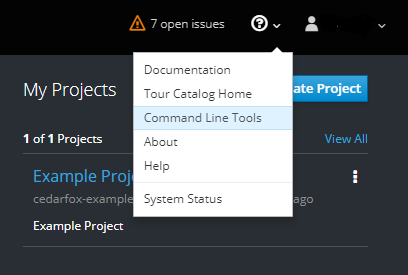
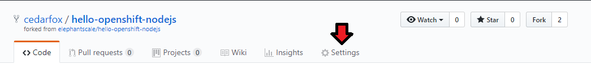
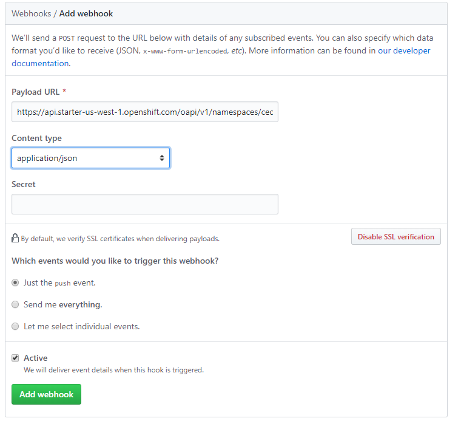

# Openshift Lab 2.2:
===============

## Using Command Line Interface to Automatically Rebuild Your Application

### Prerequisites
 * A computer system with internet connectivity.
 * A Github account.
 * Keep an open browser window logged in to your Github account.
 * Openshift Online free account.
 * Git software installed.
 * Complete Openshift Labs 1.1, 1.2, 1.3, and 2.1 before this step.
 * A text editor of your choice installed to your system.
  * Note for Windows users: do not use notepad as the text editor. If you do not have another text editor installed, you should download and install a text editor.
  * Some example text editors:
     * Notepad ++ - https://notepad-plus-plus.org/
     * Atom - https://atom.io/
     * Brackets - http://brackets.io/
     * Visual studio code - https://code.visualstudio.com/
     * Vim text editor - https://www.vim.org/

### Note
At this point you should still have the project and sample application from the Openshift lab 2.1. If you do not, go through the steps of Openshift Lab 2.1 again.

### Topics to cover
 * Clone an application from the Github repository.
 * Login to Openshift using CLI.
 * Delete existing webhooks from your Github account.
 * Obtain a webhook URL using CLI.
 * Add a webhook using the URL you have obtained.
 * Edit the source code of your application.
 * Deploy an example app from source code
 * Use "git push" to update changes.


### Step 1 - Clone an Application from the Github repository
 ** Note: If you already did this in Lab 1.2, then you do not need to repeat it. **

  * Open up a separate web window/tab to your Github account and sign in using your Github credentials.

  * Follow the link below. https://github.com/elephantscale/hello-openshift-nodejs

    * This will bring you to the elephantscale/hello-openshift-nodje repository with an example Node.js application which will display a message on the site.

  * On the upper right hand corner of the Github repository, click on the "Fork" button.  This will provide you with your own copy of the application in your Github account.


   <p style="text-align:center;"></p>

  * If using Windows, open the Git Bash console on your local computer as described in Openshift Lab 1.1.  If using Mac or Linux computers, you can use the terminal.

  * Enter the following commands into the Git Bash console or terminal to clone the example application to your local computer and to change directories to that app.  Put your actual Github username in place of "username".  

  ```bash
  $ git clone https://github.com/username/hello-openshift-nodejs
  $ cd hello-openshift-nodejs
 ```
### Step 2 - Login to Openshift using CLI

  * Login to your Openshift online account using a web browser and navigate to the web console.

  * On the top right of your screen you will see a "?" with a down arrow as pictured below.

  * Click on the down arrow and then click on "Command Line Tools."

<p style="text-align:center;"></p>

   * This will bring you to a screen as pictured below.

   <p style="text-align:center;"></p>

   * Click the copy icon to the right of the "oc login" field.

   * Open your terminal; or in Windows, run the Command Prompt "as an administrator."

   * Paste the oc login code into the Command Prompt or terminal and hit enter.

   * This should log you in to the Openshift CLI; keep the Command Prompt or terminal window open.

### Step 3 - Delete Existing Webhooks from Your Github Account

   * Navigate to the following address, but replace "username" with your actual Github username: https://github.com/username/hello-openshift-nodejs

   * Click on the Settings button.

   <p style="text-align:center;"></p>

   * Click on the webhook tab on the left.

   * Look under webhooks and see if there is already a webhook installed. If there is, click delete. Then click the "Yes, delete webhook" button.

   * Keep this window open.

### Step 4 - Obtain a Webhook URL using the CLI

   * Open up a new text file with your preferred text editor.

   * Go back to your command prompt/terminal window.

   * Type the following command. Note that "bc" means BuildConfig.

          oc describe bc hello-openshift-nodejs

   * This will print up information from the application's BuildConfig file.

   * Look for the field that says "Webhook Github URL:".
   * Select the entire URL and copy it to your clipboard.

   * Paste the URL into your new text file.

   * Type the following command to save a copy of the BuildConfig file to your local directory.

          oc get bc/hello-openshift-nodejs -o json > bc.json

* Navigate to the current directory and open the bc.json file using a text editor. (if using Windows, you can use Windows Explorer to navigate to the folder. Do not use notepad for the text editor.)

* Scroll down the file until you see the word "github" and underneath, "secret" as pictured below.

 <p style="text-align:center;"></p>

* Copy the secret text under "github" without copying the quotes.

* Paste the secret characters in the new text file underneath the URL you pasted earlier.

* You will see that the URL ends in ` .../hello-openshift-nodejs/webhooks/<secret>/github`

* Delete the characters : ` <secret> `

* In between the slashes where ` <secret> ` was, paste the actual secret as in the example below.

 <p style="text-align:center;"></p>

 * Now select and copy the entire URL which has the secret in it.  

### Step 5- Add a Webhook Using the URL You Have Obtained

 * Go back to your open Github browser window.

 * Click the "Add webhook" button on the upper right.

 <p style="text-align:center;"></p>

 * Click the Payload URL field and press ctrl-V to paste the URL you copied to the clipboard earlier.

 * Under Content type, select application/json.

 <p style="text-align:center;"></p>

 * Click on the green "Add webhook" button.  A green check to the left of the address means it correctly configured.  Note that it may not show a green check until you use "git push" to update your changes.

<p style="text-align:center;"></p>

### Step 6 - Edit the Source Code of your Application

Navigate to the local cloned copy of hello-openshift-nodejs.

   * Note, if using Git Bash, the cloned copy will be in the hello-openshift-nodejs folder inside the starting default folder.

   * In Windows, the default starting folder is C:\users\your-username\
        * (Replace "your-username" with your Windows user account name).


   * Open the server.js file inside the hello-openshift-nodejs using a text editor.

   <p style="text-align:center;"></p>

   * In line 7, after the word "app." but before "\n", type your own custom text. You could type "Excellent!!!" without the quotes, or something else if you prefer.

   <p style="text-align:center;"></p>


   * Save your changes to the file.

### Step 7 - Use "git push" to Update Changes

  * Open the Git Bash command line (terminal in Linux/Mac).

  * Change directories to the application. (Note: do not type the $ in these examples.)

            $ cd hello-openshift-nodejs`

  * Type ``` git status ``` and it should list server.js in red.

  <p style="text-align:center;"></p>


  * Now type the following.

          $ git add server.js


  * Type ``` git status ``` again and it should list server.js in green.

    <p style="text-align:center;"></p>

  * Type ``` git commit ``` and press enter.

  * A new window opens and type a description of your changes.

  <p style="text-align:center;"></p>

  * Then follow the prompts to hit ctrl-x then press "Y," then press Enter.

  * Type ``` git push ``` into the command prompt and hit enter.
      * This will upload the changes into the server.


  * Open your command prompt/terminal where you were using the "oc" commands and type:

        oc get routes

  * Under HOST/PORT it will tell your URL for your apps. Copy the entire URL to the clipboard.

  * Paste the URL into a new browser window and hit enter.

  * It should show you the application text.  It may take a couple minutes to update the app after you push the changes.  But after a couple of minutes, it should read the new text.

  <p style="text-align:center;"></p>

  * If it shows the text which you added in the source code, then you have configured it correctly.


## Thanks for completing Openshift Lab 2.2!
* You may now proceed to Openshift Lab 2.3.


Information obtained from https://docs.openshift.com/online/getting_started/beyond_the_basics.html#getting-started-beyond-the-basics
