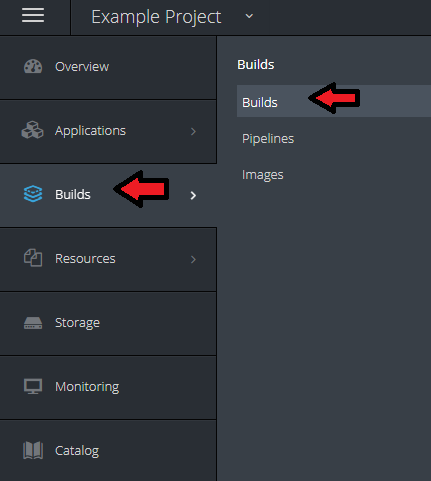

# Openshift Lab 2.3:
===============

## Using Web Console and Command Line Interface to View and Edit Configuration Files

### Prerequisites
 * A computer system with internet connectivity.
 * A Github account.
 * Keep an open browser window logged in to your Github account.
 * Openshift Online free account.
 * Git software installed.
 * Complete Openshift Labs 1.1, 1.2, 1.3, 2.1, and 2.2 before this step.
 * A text editor of your choice installed to your system.
  * Note for Windows users: do not use notepad as the text editor. If you do not have another text editor installed, you should download and install a text editor.
  * Some example text editors:
     * Notepad ++ - https://notepad-plus-plus.org/
     * Atom - https://atom.io/
     * Brackets - http://brackets.io/
     * Visual studio code - https://code.visualstudio.com/
     * Vim text editor - https://www.vim.org/


### Topics to Cover
 * How to view and edit configuration files using the web console.
 * How to configure health checks using the web console.
 * How to view and edit configuration files using the CLI.
 * How to configure health checks using CLI.
 * How to create and edit secret files.
 * How to create a PersistentVolumeClaim (PVC) and edit the PVC object definition file.
 * How to create pods and edit pod object definition files.


### How to View and Edit Configuration Files Using the Web Console

* Log in to your Openshift online account and navigate to the web console.

* Click on your project name in the upper right hand of the screen.

* Open the BuildConfig file on the web console by doing the following steps.

     * On the left side of the screen, click the "Builds" tab, then click the word "Builds" in the menu.

  <p style="text-align:center;"></p>

  * Click on the name of the build.  In this case it is "hello-openshift-nodejs."

  * On the upper right hand of the screen click the "Actions" button, then click on "Edit YAML".

    <p style="text-align:center;"></p>

* Edit the BuildConfig file.

  * Scroll down through the lines to see what is in the BuildConfig file.

  * Scroll down to Line 16 where it says "failedBuildsHistoryLimit: 5".

  <p style="text-align:center;"></p>

  * Change the number 5 to a ` 6 `.

  * Click the blue "Save" button.  You should see a confirmation that the build configuration was updated.

* Open the DeploymentConfig file on the web console doing the following.

   * On the left side of the screen, click the "Applications" tab, then click "Deployments" in the menu that opens.

<p style="text-align:center;"></p>

   * Click on the name of the application. In this case it is "hello-openshift-nodejs."

   * Click on the button in the right upper hand of the screen that says "Actions." Then click "Edit YAML."

   * Scroll down to review the contents and note how many lines are in the DeploymentConfig file. Remember the number.

   * Then click "cancel" on the bottom to exit the screen.

### How to Configure Health Checks using the Web Console

* Add a readiness Probe -- a type of health check.

  * On the right upper hand of the screen, click "Actions," then click "Edit Health Checks."

  * Click the link that says "Add readiness probe."

  * In the field that says Path, type ` /healthz `.

  * In the field that says Initial Delay, type ` 15`

  * Ensure that port is set to 8080 and Timeout set to 1.

  * Click save at the bottom. This will save the readiness probe to the DeploymentConfig file.

  <p style="text-align:center;"></p>

  * Click save at the bottom. This will save the readiness probe to the DeploymentConfig file.


* Open the DeploymentConfig file again using "Edit YAML" and scroll down to view the contents.

  * In line 49 of the DeploymentConfig file, you should see the readiness probe added to the file with the specifications below.

  * In line 55, you will see "initialDelaySeconds: 15".  Change the number 15 to ` 16 `.

  <p style="text-align:center;"></p>


  * Scroll down to the bottom, you will see that there are a few more lines total in the DeploymentConfig file.

  * Click the Save Button.

* Now, we will add a liveness probe as well.  

  * Click "Actions," then click "Edit Health Checks."

  * Click "Add liveness probe."

  * In the field that says Path, type ` /healthz `.

  * In the field that says Initial Delay, type ` 15`

  * Ensure that port is set to 8080 and Timeout set to 1.

  * Click the Save Button.

* Open the DeploymentConfig file again using "Edit YAML" and scroll down to view the contents.

  * Look through the lines and identify the liveness probe details and readiness code details.

  * When you are done looking click "Cancel."

### How to View and Edit Configuration Files using CLI

* Log in to Openshift by CLI (if not already logged in).

   * Open the terminal window or command prompt window "as an administrator."

   * If you are not logged in, use the "oc login" command as described in Lab 2.1.

* View the BuildConfig file using the `oc edit` command.
```
            oc edit bc/hello-openshift-nodejs
```

   * A text editor should open up with the contents of the BuildConfig.  

       * Note that Windows will likely use Notepad by default for this option, so it is not advisable to save any changes with Notepad, since Notepad may not save the text in the correct format.

   * Look through the contents of the BuildConfig file and then close the text editor.

* View and edit the BuildConfig file using the `oc get` command.

   * Save a local copy of the BuildConfig file in .json format by the following command.

   ```
          oc get bc/hello-openshift-nodejs -o json > test.json
   ```

   * Open the file test.json using a text editor (but do not use notepad).

   * Scroll down to the field "failedBuildsHistoryLimit: 6".

   * Change the number 6 to ` 7 `.

   * Save the file and close your text editor.

   * Type the following command to replace BuildConfig file on the server with your local copy.
```
          oc replace -f test.json
```

   * Edit it again using `oc edit`.
```
          oc edit bc/hello-openshift-nodejs
```

   * Confirm that the "failedBuildsHistoryLimit:" now shows "7."

   * Close the text editor without saving.


* Now practice this same process with the DeploymentConfig file as you did above with the BuildConfig file.

    * View the file in a text editor.

```
          oc edit dc/hello-openshift-nodejs
```

  * Save a copy of the DeploymentConfig locally.

```
          oc get dc/hello-openshift-nodejs -o json > testdc.json
```

  * Open the file testdc.json in a text editor.

  * Scroll down to the text about "liveness probe" and look below for the text that says "initialDelaySeconds : 15"

  * Change the number "15" to `17`.

  * Save the changes with the text editor and close the editor.

  * Type in the "oc replace" command to replace the file on the server.

   ```
          oc replace -f testdc.json
   ```

* Use the `oc edit` command to verify that changes were applied.

    ```
          oc edit dc/hello-openshift-nodejs
    ```

* Look in the code under "liveness probe" and it should read "initialDelaySeconds : 17".

* Close the text editor without saving.

### How to Configure Health Checks using CLI

* Delete all existing readiness and liveness probes using `oc set probe` by typing the following command.

      oc set probe dc/hello-openshift-nodejs --remove --readiness --liveness

* Use the `oc edit` command to verify that changes were applied.

 ```
      oc edit dc/hello-openshift-nodejs
```

  * The information about readiness probes and liveness probes should be removed from the DeploymentConfig file.

  * Close the text editor without saving.

* Create a readiness probe like the one we made in the web console by the following command.

 ```
      oc set probe dc/hello-openshift-nodejs --readiness --get-url=http://:8080/healthz --initial-delay-seconds=20
```

  * This time we will set the initial delay to 20 - a different number than before.


* Create a liveness probe by using this command.

```
      oc set probe dc/hello-openshift-nodejs --liveness --get-url=http://:8080/healthz --initial-delay-seconds=20
```


* Create a readiness probe by using this command.

   ```
      oc set probe dc/hello-openshift-nodejs --readiness --get-url=http://:8080/healthz --initial-delay-seconds=20
   ```

* You can change the parameters by running the command again.  This command uses the --open-tcp argument to update the port to 3306 in the liveness probe.

  ```
      oc set probe dc/hello-openshift-nodejs --liveness --open-tcp=3306
  ```

* Use the `oc edit` command to verify that changes were applied.

  ```
        oc edit dc/hello-openshift-nodejs
  ```

    * Close the text editor without saving.

###  How to Create and Edit Secret Files

* Navigate to this site to get an example secret file.
https://docs.openshift.com/online/dev_guide/secrets.html#secrets-examples

* Locate the example secret as in the image below, and select and copy the secret data starting with "apiVersion".

<p style="text-align:center;"></p>


* Open a text editor to a new file and copy the fields.

* Change the name of the secret from "mysecret" to ` secret1 `

* Save the file using the .yaml format and call it secret1.  Save it in the directory you are working in with your terminal or command prompt.

* Type the following command to create a secret object using the file.

```
      oc create -f secret1.yaml
```

* It should say "secret 'secret1' created."

* Check the list of secrets by typing: `oc get secret`; "secret1" should be listed.

* To view the secret in the default editor type this command.

```
        oc edit secret secret1
```

* View the file, then close the file without saving.

* To save a copy of the secret file to your computer, use the `oc get` command.

```
      oc get secret secret1 -o yaml > testsecret.yaml
```

* Now open the testsecret.yaml using a text editor.  

* We won't actually make changes, but for the sake of example, we will imagine the file has been modified.  Close the text editor.

* Replace the secret on the server with the local file testsecret.yaml by typing the following command.

```
        oc replace -f testsecret.yaml
```


### How to Create a PersistentVolumeClaim (PVC) and Edit the PVC Object Definition File

* Check if you have any PVCs in your project by typing: `oc get pvc`.

* It should say "No resources found," unless you have created one.

* Create a PVC using the `oc volume` command:

```
      oc volume dc/hello-openshift-nodejs --add --name=v1 -t pvc --claim-size=1Gi --overwrite
```

  * The `--overwrite` argument will cause the new PVC to overwrite an existing volume, if present.

* Now type `oc get pvc` again to check the status. Check the name of the PVC.

* You may view the PVC object definition file by typing the following.  Replace "pvc-4jdp8" with the actual name of your PVC.

```
        oc edit pvc/pvc-4jdp8
```

* You may save a local copy of the PVC object definition file using this command. Replace pvc-4jdp8 with the actual name of the PVC.

```
      oc get pvc pvc-4jdp8 -o yaml > pvc.yaml
```

* Open the file pvc.yaml with a text editor to view the contents. Then close the file.

* Imagine that we have modified the pvc.yaml file and now we will use the local copy to replace the pvc.yaml file on the server.

```
      oc replace -f pvc.yaml
```

### How to Create Pods and Edit Pod Object Definition Files

* Navigate to the following website to get the text for an example pod. Select and copy the pod text from example 2.  https://docs.openshift.com/online/dev_guide/secrets.html#secrets-examples

<p style="text-align:center;"></p>


* Open a text editor to a new file and paste the text.

* Change the name of the "secretName" from "test-secret" to ` secret1 `

* Save the file using the .yaml format and call it expod.yaml .  Save it in the directory you are working in with your terminal or command prompt.

* Create a new pod using the expod.yaml file by the following command.

```
        oc create -f expod.yaml
```

* Check the status of pods by typing `oc get pods`. You should get a response similar to the following.

<p style="text-align:center;"></p>

* View the pod object definition file by typing this command.

```
          oc edit pod secret-example-pod
```

  * After viewing the file, close the text editor without saving.


* Save a local copy of the pod file by typing the following command.

```
      oc get pod secret-example-pod -o yaml > expod2.yaml
```

* For the sake of the exercise, imagine that we have modified the expod2.yaml file.

* Now use the `oc replace` command to load our local copy of the file on to the server.

```
        oc replace -f expod2.yaml
```

* You should get a response that says "pod 'secret-example-pod' replaced."


## Thanks for completing Openshift Lab 2.3!


Information obtained from https://docs.openshift.com/online/getting_started/beyond_the_basics.html#getting-started-beyond-the-basics
https://docs.openshift.com/online/dev_guide/secrets.html#secrets-examples
