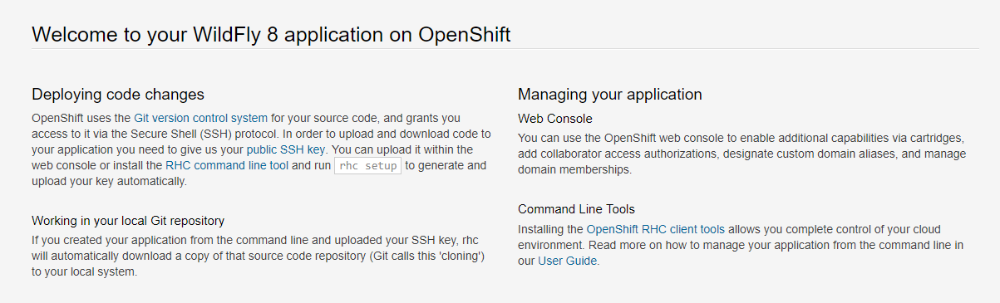

# Openshift Lab 3.1:
===============

## Working with Complex Deployments

### Prerequisites
 * A computer system with internet connectivity.
 * A Github account.
 * Keep an open browser window logged in to your Github account.
 * Openshift Online free account.
 * Git software installed.
 * Complete Openshift Labs 1.1, 1.2, 1.3, 2.1, 2.2, and 2.3 before this step.
 * A text editor of your choice installed to your system.
  * Note for Windows users: do not use notepad as the text editor. If you do not have another text editor installed, you should download and install a text editor.
  * Some example text editors:
     * Notepad ++ - https://notepad-plus-plus.org/
     * Atom - https://atom.io/
     * Brackets - http://brackets.io/
     * Visual studio code - https://code.visualstudio.com/
     * Vim text editor - https://www.vim.org/


### Topics to Cover

* Scaling an application.
* Autoscaling an application.
* Practice creating pods with an affinity rule.
* Clustering an application.
* Creating a router in Openshift.

### Notes
* If the example commands show a $ command prompt, then do not actually type the $.


### Initial preparation

* Keep a browser window logged into your Github account.

* Open a browser window and log in to your Openshift Online account and enter the web console.

* Open a terminal (or in Windows a command prompt "as an administrator".)

* If you are not logged in to your Openshift Online account through the command prompt/terminal, then log in using the `oc login` command copied from your web console.
(Lab 2.1 describes how to login).

* Type `oc project` into the command line. It will tell you the name of the project you are working on.

* If you have the free Openshift Online starter account, then you can only have one project.  Delete the project by typing `oc delete project username-example`.  Replace username-example with the name of your project.

* Make a new project with a unique name using the following command.  Replace username-project with the name you want to give the project.

        oc new-project username-project --display-name="Test Java Application"

### Install an Example Application

* Step 1.  Open the browser window to the following Github link: https://github.com/elephantscale/jee-start

* Step 2. Fork the application by clicking the "Fork" button on the upper right hand of the screen.

<p style="text-align:center;"></p>

* Step 3. Open your Git Bash or terminal window.  

* Step 4. You may optionally change directories to the directory where you want to clone the file.

* Step 5.  In your Git Bash window or terminal window, clone the forked application from your repository. Instead of "username," type your actual Github username.

        $  git clone https://github.com/username/jee-start
        $  cd jee-start

* Step 6. Install the jee-start application by typing this command in your command prompt/terminal. Replace the "username" in the Github URL with your actual Github username.

      oc new-app openshift/wildfly-101-centos7~https://github.com/username/jee-start.git --name=jee-start

* Step 7. Check the status of the new-app by typing `oc status`.

* Step 8. Give the application a route with the following command.

          oc expose svc/jee-start

* Step 9. Type `oc get routes` into the command line, then copy the URL under the HOST/PORT field to your clipboard.

* Step 10. Paste the URL into a new web browser window address bar.

<p style="text-align:center;"></p>

* Step 11. Note that this applciation has a hidden HelloWorld link.   After the end of the existing URL in the web browser, add `/HelloWorld` and you should get a view of the HelloWorld screen.

<p style="text-align:center;"></p>


### Scaling an Application

* Step 1. Check for information about replication controllers by typing `oc get rc`.
* Step 2. Check for information about pods by typing `oc get pods`.

<p style="text-align:center;"></p>

* Step 3. Manually scale the application using the oc scale command.

        oc scale dc jee-start --replicas=5

* Step 4.  Check for information again about replication controllers by typing `oc get rc`, and about pods by typing `oc get pods`.

<p style="text-align:center;"></p>

It should show that there is "5" under "DESIRED", and "2" or more under "CURRENT."  Notice in this example that it increased the number of pods from 1 to 2.

* Step 5. Navigate to your project under the web console. Then click on the name of your application "jee-start" and the "Configuration" tab.

<p style="text-align:center;"></p>

* Step 6. Click on the pencil next to the "5 replicas," and change it to 10 and click the checkmark.

* Step 7. Type `oc get rc` again in the command line, and it should show you 10 under the "DESIRED" field.

### Autoscaling an application

* Step 1.  Go back to the web console window and look on the same page where you changed the replicas, and on the right, click the "Add autoscaler" link.

* Step 2. Fill in the details in the form as the following:
   * Min pods: 1, Max pods: 8, CPU Request Target: 80%.
   * Then click "Save."

<p style="text-align:center;"></p>

* Step 3. Go to your CLI and type `oc get hpa` to get information on the autoscaling.  it will provide details regarding the numbers of pods and CPU usage.

* Step 4. Turn off autoscale by deleting the hpa: `oc delete hpa --all`.
* Step 5. Now autoscale using the `oc autoscale` command.

        oc autoscale dc/jee-start --min=1 --max=10 --cpu-percent=75

* Step 6. Type `oc get hpa` to check the status again.

<p style="text-align:center;"></p>

* You have successfully scaled and autoscaled.

### Practice Creating Pods with an Affinity Rule
* In Lab 2.3, we walked through the process of how to create a pod and edit the pod object defintion file.

* A pod affinity rule is a form of advanced pod scheduling which tries to put that type of pod on the same node.   An Anti-affinity rule tries to put the pods on different nodes.

* This is an example of a pod affinity configuration.  (Note that on Openshift Online Starter, there is not enough resources to run both copies of the hello-pod images, so in the second file, we changed the name of the image file so it would install. )

* Step 1. Select the following text and copy it to the clipboard.

```
apiVersion: v1
kind: Pod
metadata:
  name: team4
  labels:
     team: "4"
spec:
  containers:
  - name: ocp
    image: docker.io/ocpqe/hello-pod

```

* Step 2. Open up a new text file in your text editor and paste the text in. Save it in yaml format with the name team4.yaml .

* Step 3. Now select the following text and copy it to your clipboard.


```
apiVersion: v1
kind: Pod
metadata:
  name: team4a
spec:
  affinity:
    podAffinity:
      requiredDuringSchedulingIgnoredDuringExecution:
      - labelSelector:
          matchExpressions:
          - key: team
            operator: In
            values:
            - "4"
        topologyKey: kubernetes.io/hostname
  containers:
  - name: pod-affinity
    image: openshift/origin-docker-registry:v0.6.2
```

Examples obtained from: https://docs.openshift.com/container-platform/3.9/admin_guide/scheduling/node_affinity.html

* Step 4. Open up another new text file and paste the above text in. Save it in yaml format with the name team4a.yaml .

* Step 5. Create the pods by typing `oc create -f team4.yaml`, enter, `oc create -f team4a.yaml`

* Step 6. Type `oc get pods`.  You should see the team4 and team 4a pods listed.

    * This was just an example to show the process.  You may have a CreateContainerError listed on team4a pod due to using the origin-docker-registry image.


* Step 7. Delete the pods by typing `oc delete pod team4`, enter, `oc delete pod team4a`.

### Creating a Router in Openshift
* Routers are a component of Openshift Container Platform, but in Openshift Online, the Routing is built-in.  You can still create a router in Openshift Online, though there will be some errors.

* Step 1. Save a copy of default router settings before creating.  

        oc adm router --dry-run -o yaml > router.yaml

 * Ignore the error it gives you.  In Openshift Container Platform, you can actually create the router using the "oc adm router" command.


* Step 2. Open the file router.yaml with a text editor and scroll down through the settings.

* Step 3. Change the number of replicas (on line 31) from 1 to 3. Then save the file.

* Step 4. Type the following command `oc create -f router.yaml`.

* Step 5. View the status by typing `oc get all`.

* You can view any of the router configuration files by using the oc edit command, like in this example.

      oc edit dc/router

* When you are done viewing the configuration files, close them in the editor without saving.


### References

* Duncan, J., Osborne, J. (2018). Openshift In Action. Pages 147-167. Manning Publications: Shelter Island, NY.  www.allitebooks.com

https://docs.openshift.com/container-platform/3.6/install_config/router/index.html#install-config-router-overview

https://docs.openshift.com/container-platform/3.6/install_config/router/default_haproxy_router.html#install-config-router-default-haproxy

https://docs.openshift.com/container-platform/3.9/admin_guide/scheduling/scheduler.html

https://docs.openshift.com/online/architecture/core_concepts/pods_and_services.html

https://docs.openshift.com/container-platform/3.9/admin_guide/scheduling/node_affinity.html


## Thanks for completing Openshift Lab 3.1!
