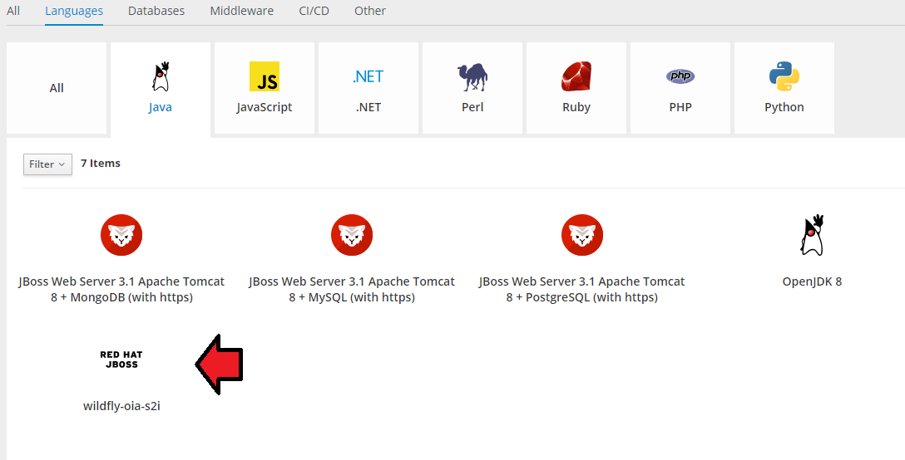
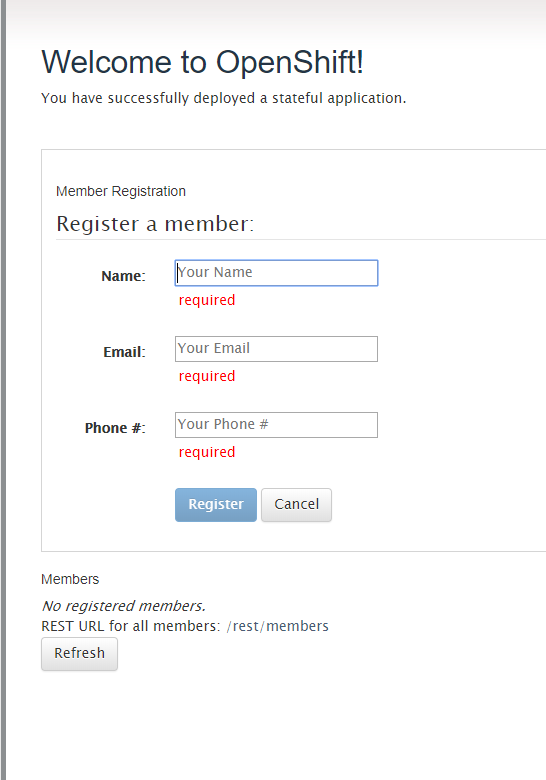

# Openshift Lab 3.1:
===============

## Working with Application Clustering

### Prerequisites
 * A computer system with internet connectivity.
 * A Github account.
 * Keep an open browser window logged in to your Github account.
 * Openshift Online free account.
 * Git software installed.
 * Complete Openshift Labs 1.1, 1.2, 1.3, 2.1, 2.2, 2.3, and 3.1 before this step.
 * A text editor of your choice installed to your system.
  * Note for Windows users: do not use notepad as the text editor. If you do not have another text editor installed, you should download and install a text editor.
  * Some example text editors:
     * Notepad ++ - https://notepad-plus-plus.org/
     * Atom - https://atom.io/
     * Brackets - http://brackets.io/
     * Visual studio code - https://code.visualstudio.com/
     * Vim text editor - https://www.vim.org/

### Topics to Cover

* Installing an example application which uses application clustering.

### Notes
* If the example commands show a $ command prompt, then do not actually type the $.

### Initial preparation

* Keep a browser window logged into your Github account.

* Open a browser window and log in to your Openshift Online account and enter the web console.

* Open a terminal (or in Windows a command prompt "as an administrator").

* If you are not logged in to your Openshift Online account through the command prompt/terminal, then log in using the `oc login` command copied from your web console.
(Lab 2.1 describes how to login.)

* Type `oc project` into the command line. It will tell you the name of the project you are working on.

* If you have the free Openshift Online starter account, then you can only have one project.  Delete the project by typing `oc delete project username-project`.  Replace username-example with the name of your project.

* Make a new project with a unique name using the following command.  Replace username-stateful with the name you want to give the project.

        oc new-project username-stateful --display-name="Test Wildfly Application"

### Install an Example Application which Uses Application Clustering

* Step 1. Navigate to the following Github repository.

   https://github.com/elephantscale/openshift-cluster-example

* Step 2. Fork the application by clicking the "Fork" button on the upper right hand of the screen.

* Step 3. Open your Git Bash or terminal window.  

* Step 4. You may optionally change directories to the directory where you want to clone the file.

* Step 5.  In your Git Bash window or terminal window, clone the forked application from your repository. Instead of "username," type your actual Github username.

        $  git clone https://github.com/username/openshift-cluster-example.git

        $  cd openshift-cluster-example

* Step 6.  Copy the file wildfly-template.yaml to the directory you are working in with your command prompt/terminal.  This example would copy the file back two directories.

        $ cp wildfly-template.yaml ../../wildfly-template.yaml

* Step 7. In your command prompt/terminal make sure that the wildfly-template.yaml file is there by typing "dir" (or "ls").

* Step 8. Load the template using the following command.  

      oc create -f wildfly-template.yaml

* Step 8.  Navigate to your web console, click the project name, then click on the blue "Browse catalog" button.  Next, click on languages, Java, and then the  wildfly-oia-s2i option.

* Step 9.  Click next, then change the Github source repository URL to the following.  Instead of "username" in the URL it should be your Github username.

 https://github.com/username/openshift-cluster-example

* Step 10. Click on the blue "Create" button and it will start to build your app.  Then click on the "Overview" tab on the top left.  It will take a few minutes to build the application.

* Step 11. Create a readiness probe using the web console using the following specifications.  Then click save.

    * Type: HTTP GET
    * Path: /
    * Port: 8080
    * Initial Delay: 20
    * Timeout 1

* Step 12. Use the following command to allow the pods to view the data.  There are two places where it says username-stateful, you should replace that with the actual name of your project.

      oc policy add-role-to-user view system:serviceaccount:username-stateful:default -n username-stateful

* Step 13. When the build is ready, you will see a URL route on the top right on the overview tab.  Click on the URL to navigate to the page.

* Step 14. In your command prompt, type `oc get pods` and note the name of the running pod.

* Step 15. Open up 2 different tabs from the URL route from your app. In one tab, Register 3-4 fake members by typing in the details and click "Register" for each.  Click "Refresh" when you are done.

* Step 16. On the duplicate tab, click "Refresh" and the user information you entered on the other tab should show up.

* Step 17. Go back to your application in the web console and look in the configuration settings under Applications / Deployments. Scale the application by increasing the number of replicas to "2".

* Step 18. Type `oc get rc` in the CLI to verify the number of replicas running. It should read 2.

* Step 19. Type `oc get pods` again and then delete the original pod using the following command. Replace "pod-name" with the actual pod name.  Note that you should be deleting the oldest running pod.  There should still be another running pod left.

        oc delete pod pod-name

* Step 20. It may take a minute for the system to update, then open the browser tab where you entered registered members. Hit refresh.  If it was configured properly, you should still have your user data showing up in the member list.

In this example, we have configured an application which automatically shared data between pods, without storing it on a PVC.

This example was obtained from "Openshift in Action" chapter 8.  For more information, the chapter goes on to describe how to install statefulsets and PVCs. 

### References

Example application obtained from "Openshift In Action" chapter 8.
* Duncan, J., Osborne, J. (2018). Openshift In Action. Pages 147-167. Manning Publications: Shelter Island, NY.  www.allitebooks.com

https://docs.openshift.com/container-platform/3.6/install_config/router/index.html#install-config-router-overview

https://docs.openshift.com/container-platform/3.6/install_config/router/default_haproxy_router.html#install-config-router-default-haproxy

https://docs.openshift.com/container-platform/3.9/admin_guide/scheduling/scheduler.html

https://docs.openshift.com/online/architecture/core_concepts/pods_and_services.html

## Thanks for completing Openshift Lab 3.2!
