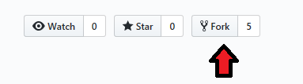
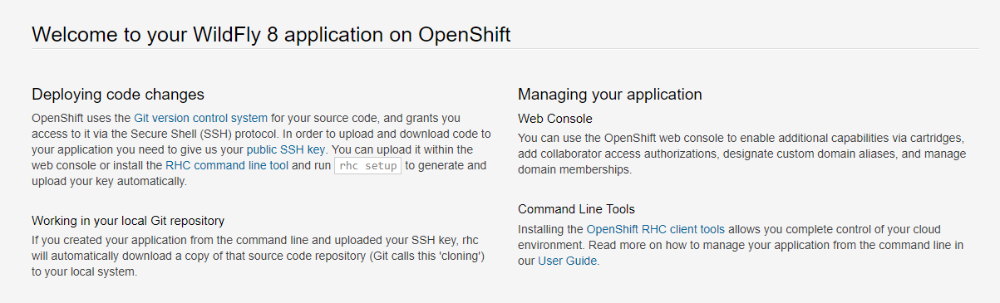
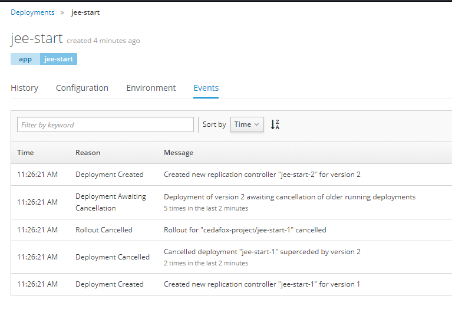

# Openshift Lab 4.1:
===============

## Troubleshooting Applications

### Prerequisites
 * A computer system with internet connectivity.
 * A Github account.
 * Keep an open browser window logged in to your Github account.
 * Openshift Online free account.
 * Git software installed.
 * Complete Openshift Labs 1.1, 1.2, 1.3, 2.1, and 2.2 before this step.
 * A text editor of your choice installed to your system.

  * Note for Windows users: do not use notepad as the text editor. If you do not have another text editor installed, you should download and install a text editor.

  * Some example text editors:
     * Notepad ++ - https://notepad-plus-plus.org/
     * Atom - https://atom.io/
     * Brackets - http://brackets.io/
     * Visual studio code - https://code.visualstudio.com/
     * Vim text editor - https://www.vim.org/

 * For the optional tutorial, you would need Eclipse or another remote Java application debugging software installed. It would be recommended to already know how to use the debugging software prior to starting the tutorial.

### Topics to Cover:
* Installing an example Wildfly application.
* View events and logs.
* Using the `oc debug` and `oc rsh` commands.
* Optional tutorial about debugging using Eclipse.

### Initial preparation

 * Keep a browser window logged into your Github account.

 * Open a browser window and log in to your Openshift Online account and enter the web console.

 * Open a terminal (or in Windows a command prompt "as an administrator".)

 * If you are not logged in to your Openshift Online account through the command prompt/terminal, then log in using the `oc login` command copied from your web console.
 (Lab 2.1 describes how to login).

 * Type `oc project` into the command line. It will tell you the name of the project you are working on.

 * If you have the free Openshift Online starter account, then you can only have one project.  Delete the project by typing `oc delete project username-example`.  Replace username-example with the name of your project.

 * Make a new project with a unique name using the following command.  Replace username-project with the name you want to give the project.

         oc new-project username-project --display-name="Test Java Application"

### Install an Example Wildfly Application
Note: if you have already forked and cloned this application, then skip to step 6.

 * Step 1.  Open the browser window to the following Github link: https://github.com/elephantscale/jee-start

 * Step 2. Fork the application by clicking the "Fork" button on the upper right hand of the screen.

 

 * Step 3. Open your Git Bash or terminal window.  

 * Step 4. You may optionally change directories to the directory where you want to clone the file.

 * Step 5.  In your Git Bash window or terminal window, clone the forked application from your repository. Instead of "username," type your actual Github username.

         $  git clone https://github.com/username/jee-start
         $  cd jee-start

 * Step 6. Install the jee-start application by typing this command in your command prompt/terminal. Replace the "username" in the Github URL with your actual Github username.

       oc new-app openshift/wildfly-101-centos7~https://github.com/username/jee-start.git --name=jee-start

 * Step 7. Check the status of the new-app by typing `oc status`.

 * Step 8. Give the application a route with the following command.

           oc expose svc/jee-start

 * Step 9. Type `oc get routes` into the command line, then copy the URL under the HOST/PORT field to your clipboard.

 * Step 10. Paste the URL into a new web browser window address bar.

 

 * Step 11. Note that this application has a hidden HelloWorld link.   After the end of the existing URL in the web browser, add `/HelloWorld` and you should get a view of the HelloWorld screen.

 

### View Events and Logs

* Step 1. Navigate to your Openshift web console and select the project you have made.

* Step 2. Click on Applications / Deployments. Then click the Event tabs and view through the events.

 

* Step 3. View events from the CLI by typing `oc get ev` and it will print out a list of all events.

* Step 4. Open your web console window and click on the "History" tab. Then click on the "View Log" link.   This will show you the deployment log. (In case the deployment isn't running, click on the "Deploy" button on the upper right hand first, then view logs.)

* Step 5. View the pod log.  Click on Applications and then Pods in the menu.  Then click on the name of a pod which is running.  Then click on the "Logs" tab.

* Step 6. Look through the logs of the pod. The log will stream new information automatically if it becomes available.

* Step 7. Click on Builds on the upper left, then Builds in the menu.  Then click on the name of the build which should be "jee-start". Then click on the "View Log" link.

* Step 8. Scroll down the log file of the Builds log.

* Step 9. View the BuildConfig log from the CLI using this command. It will print the log in your command line.

        oc logs bc/jee-start

* Step 10. Save a local copy of the DeploymentConfig log from the CLI using this command.

       oc logs dc/jee-start > log.txt

* Step 11. View the log.txt file using your text editor.

* Step 12. View the build log from the CLI

  * Type `oc get builds` to get the name of your build. Replace jee-start-1 with the actual name of your build.

  * Type this command to print the log onto the CLI screen.

        oc logs build/jee-start-1

* Step 13. View a streaming log of a running pod.

  * Type `oc get pods` into the CLI and note the name of a running pod.

  * Type this command to print a streaming log (which updates automatically) of the pod onto the CLI.  Replace jee-start-3-hnzq2 with the name of your running pod.

      oc logs -f pod/jee-start-3-hnzq2

* Step 14. When you are done viewing it, close the command prompt/window and open a new one (in Windows, open the command prompt "as an Administrator")

### Using the Debug and Rsh Commands

* `Oc debug` creates an debugging pod to allow you to execute shell commands to the seleceted resource.

 * Step 1. In the CLI, type the following command to run the debug command to the DeploymentConfig.

        oc debug dc/jee-start

 * Step 2. This will open a shell prompt.  Now type `help` and hit enter for a list of commands.

 * Step 3. Type `exit` and hit enter to exit the shell.

 * Note that you can also use the debug command for other resources and files.

* The `oc rsh` command allows you to run shell commands to a container in a pod.

 * Type `oc get pods` and note the name of a running pod.

 * Type the following command but replace jee-start-4-q2pkj with the name of your pod.

          oc rsh jee-start-4-q2pkj

 * Type `exit` to exit the shell.

### Optional Tutorial - Debugging using Eclipse.

* Note, you will need Eclipse or a similar remote debugging software for Java installed on your system to do this tutorial.  This tutorial is only recommended if you are familiar with debugging using Eclipse or your other chosen debugging software.

* View the tutorial link in a web browser at this URL. https://blog.openshift.com/debugging-java-applications-on-openshift-kubernetes/

* You have already installed the app used for debugging in this online tutorial. But the name we have used is jee-start .

* Enable the debugging port with this command:

          oc set env dc/jee-start DEBUG=true

* You should have already cloned the jee-start files to your repository.  Add the source code to your workspace using Eclipse or other debugging software.

* Open the URL for your installed app by clicking on the URL from the web console.

* After the URL in the web browser add /HelloWorld and then hit enter.

* Type `oc get pods` to get the name of your running pods.

* Port Forward the name of the running pod using the following command. Replace jee-start-4-q2pkj with the actual name of your running pod.

      oc port-forward jee-start-4-q2pkj 8787:8787

* Now follow the steps in the tutorial in the link above. There is a 1 minute video showing the steps of configuring Eclipse to debug the application. This will show the remaining steps of this tutorial.

## Thanks for completing Openshift Lab 4.1!
